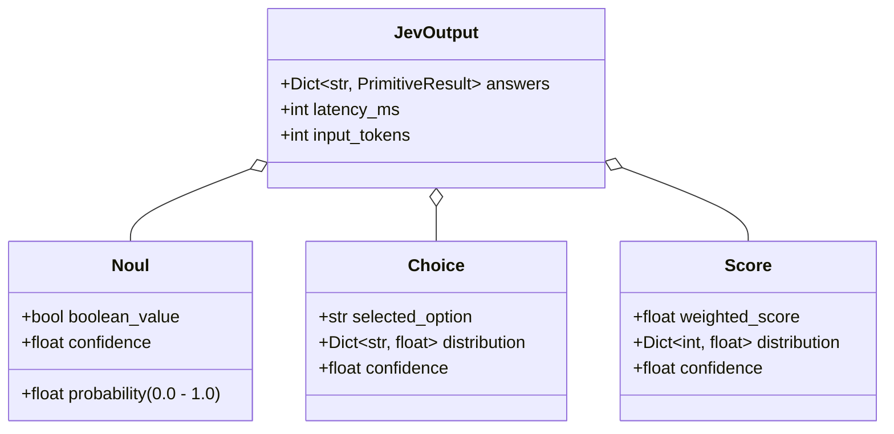

# ⚙️ 01. Jev Architecture & Mechanics

> **Related Notes:**
> - [[README|Master Index]]
> - [[02_RLCD_and_Calibration|RLCD and Calibration]]
> - [[03_LLM_Integration_Patterns|LLM Integration Patterns]]
> - [[05_Literature_Review_and_Papers|Literature Review & Papers]]

---

## 1. Executive Summary & Background

**Jev** is a non-generative, **"System One"** decision model developed by **TypeSafe AI**, an AI lab founded by **Diogo Almeida** (co-inventor of RLHF and InstructGPT at OpenAI), alongside Erik Gafni and Sasha Sheng. Launched in September 2026 with a \$40M seed round led by DCVC, Jev represents a paradigm shift in how artificial intelligence is integrated into software systems.

The model is named after the British economist **William Stanley Jevons**, referencing the famous **Jevons Paradox**: *as technological improvements increase the efficiency with which a resource is used, total consumption of that resource increases rather than decreases*. By making decision-making orders of magnitude faster and cheaper, Jev enables software architectures to evaluate machine intelligence at every line of execution.

---

## 2. The Architectural Paradigm Shift

### The Bottlenecks of Traditional LLMs for Decision Making
Traditional Large Language Models (LLMs) like GPT-4o, Claude 3.5 Sonnet, and Gemini 1.5 Pro are **autoregressive generative models**:
$$\mathbb{P}(y_1, y_2, \dots, y_T \mid x) = \prod_{t=1}^T \mathbb{P}(y_t \mid x, y_{<t})$$

When an engineer uses an LLM for classification, routing, or risk assessment:
1. **Sequential Latency:** The model must emit tokens one by one ($T$ forward passes). Even generating a small JSON blob of 50 tokens requires 50 sequential forward passes through hundreds of billions of parameters (resulting in 1,000ms – 4,000ms of latency).
2. **Schema Drift & Parsing Failures:** The model outputs strings. Developers must implement fragile JSON parsers, Pydantic validators, or grammar-constrained sampling engines (e.g., Outlines, Guidance), which add computational overhead and can still fail or loop.
3. **Prose Hallucination:** Generative decoders are trained to produce plausible text continuations, meaning they can fabricate justifications, hallucinate facts, or drift away from rigid classification criteria.

```mermaid
graph TD
    subgraph "Traditional Autoregressive LLM"
        Input1["Input Context / State"] --> Enc1["Transformer Backbone"]
        Enc1 --> T1["Token 1: '{'"]
        T1 --> T2["Token 2: 'decision'"]
        T2 --> T3["Token 3: ':'"]
        T3 --> T4["... Token N: '}'"]
        T4 --> Parse["JSON / Regex Parser"]
        Parse -->|Risk: Malformed JSON, Hallucinations| AppLogic1["Software Logic (Latency: 1.5s - 4s)"]
    end

    subgraph "Jev: Parallel Sampling Decision Engine"
        Input2["Program State (Documents, Variables)"] --> JevBackbone["Jev Encoder / Representation Layer"]
        Questions["Typed Questions Dictionary (Noul, Choice, Score)"] --> JevBackbone
        JevBackbone --> ParallelHeads["Parallel Decision Sampling Heads"]
        ParallelHeads --> Out1["Noul: 0.94 (Calibrated Prob)"]
        ParallelHeads --> Out2["Choice: 'high_priority' (0.88 conf)"]
        ParallelHeads --> Out3["Score: 8.2 / 10 (Rubric Dist)"]
        Out1 & Out2 & Out3 --> AppLogic2["Software Logic (Latency: 70ms - 300ms)"]
    end
```



---

## 3. Jev's Parallel Sampling Architecture

Jev completely abandons token-by-token autoregression in favor of a **single-pass parallel sampling architecture**.

### 3.1 Input State & Questions Formulation
Instead of a conversational prompt, Jev accepts two distinct structures:
1. **State:** Arbitrary structured or unstructured context (raw text, documents, user history, database records, code diffs, logs).
2. **Questions:** A dictionary of typed questions to be resolved simultaneously against that state.

$$\mathcal{Q} = \{q_1: \tau_1, q_2: \tau_2, \dots, q_K: \tau_K\}$$
where each $\tau_k \in \{\text{Choice}, \text{Score}, \text{Noul}\}$.

### 3.2 Single-Pass Forward Execution
In a single forward pass:
- The context and all questions are encoded into shared contextual representations.
- Dedicated decision heads evaluate each question **in parallel**.
- Latency is largely independent of the number of questions asked. Evaluating 1 question vs. 20 questions exhibits minimal latency difference because the computation is executed in a single vectorized pass.

---

## 4. The Three Typed Decision Primitives

Jev restricts all outputs to three mathematically rigorous primitives, eliminating free-form prose entirely:



### 1. `Noul` (Binary / Probabilistic Truth)
- **Concept:** A play on "No/Yes" (and Boolean nullability). Evaluates whether a condition or assertion is true.
- **Output:** Returns a continuous calibrated probability $p \in [0.0, 1.0]$ that the assertion holds true.
- **Use Case:** "Does this query contain malicious SQL injection?", "Is this customer requesting a refund?", "Is this patient record missing insurance confirmation?"

### 2. `Choice` (Categorical Selection)
- **Concept:** Selects exactly one label from a set of up to 255 discrete options with predefined criteria.
- **Output:** Returns:
  - `selected_option`: The winning label.
  - `distribution`: The full probability simplex over all provided options $\sum_{i=1}^M p_i = 1.0$.
  - `confidence`: The model's calibrated confidence in the selection.
- **Use Case:** Multi-class intent classification, routing to specialized agents/tools, department assignment.

### 3. `Score` (Ordinal Rubric Evaluation)
- **Concept:** Rates an input against an ordered rubric or scale (up to 10 discrete levels).
- **Output:** Returns:
  - `weighted_score`: The expectation $\mathbb{E}[S] = \sum_{s=1}^{10} s \cdot p(s)$.
  - `distribution`: Probability assigned to each score level.
  - `confidence`: Calibrated certainty metric.
- **Use Case:** Lead scoring, code quality evaluation, safety risk index, document relevance ranking.

---

## 5. Economic and Performance Profile

| Metric | Traditional Frontier LLM (GPT-4o / Claude 3.5) | Jev (TypeSafe AI) | Factor Improvement |
| :--- | :--- | :--- | :--- |
| **End-to-End Latency** | 1,200 ms – 4,500 ms | **70 ms – 500 ms** | **~10x – 20x faster** |
| **Input Token Cost** | \$2.50 – \$5.00 / 1M tokens | **\$0.042 / 1M tokens** | **~60x – 120x cheaper** |
| **Output Token Cost** | \$10.00 – \$15.00 / 1M tokens | **\$0.00 (Free / Zero)** | **$\infty$ (No output tokens)** |
| **Total Task Cost** | ~\$0.005 – \$0.02 per decision | ~\$0.00004 per decision | **~100x – 500x cheaper** |
| **Parsing Failure Rate** | 0.5% – 5.0% (JSON syntax, formatting errors) | **0.00% (Native Typed Primitives)** | **Deterministic Reliability** |
| **Hallucination Risk** | High (in prose explanations) | **0.00% (Architecturally Impossible)** | **Prose-Free Architecture** |

---

## 6. Official SDK Usage Example (`typesafe-sdk`)

```python
from typesafe_sdk import TypeSafeClient, Noul, Choice, Score

# Initialize the TypeSafe client
client = TypeSafeClient()  # Uses TYPESAFE_API_KEY from environment

# Define incoming state
state = {
    "user_message": "My card was charged $120 twice for order #98211. Reverse this now!",
    "user_tier": "VIP_PLATINUM",
    "account_balance": 450.00
}

# Execute parallel decision pass
response = client.system_one(
    state=state,
    questions={
        "is_billing_issue": Noul(
            instructions="Is the user reporting an incorrect charge or payment dispute?"
        ),
        "urgency": Choice(
            instructions="Classify the urgency of this customer issue.",
            criteria={
                "low": "General inquiries or minor feedback",
                "medium": "Standard requests with normal turnaround",
                "critical": "Financial discrepancies, outages, or legal threats"
            }
        ),
        "sentiment_score": Score(
            instructions="Rate the sentiment of the user on a 1 (extremely hostile) to 5 (delighted) scale."
        )
    }
)

# Programmatic software logic - zero parsing needed
if response.answers["is_billing_issue"].probability > 0.85:
    urgency = response.answers["urgency"].choice
    sentiment = response.answers["sentiment_score"].weighted_score
    print(f"Routing to Billing. Urgency: {urgency}, Sentiment: {sentiment:.2f}")
```

---

## 7. Key Architectural Takeaways

1. **Jev is not a chat model; it is an intelligent control plane.**
2. By stripping away text generation, it circumvents the fundamental bottlenecks of autoregressive inference: KV caching overhead, sequential token iteration, and stochastic formatting errors.
3. The model outputs typed probability distributions directly, turning AI into a reliable, high-speed boolean and enum operator for software pipelines.
