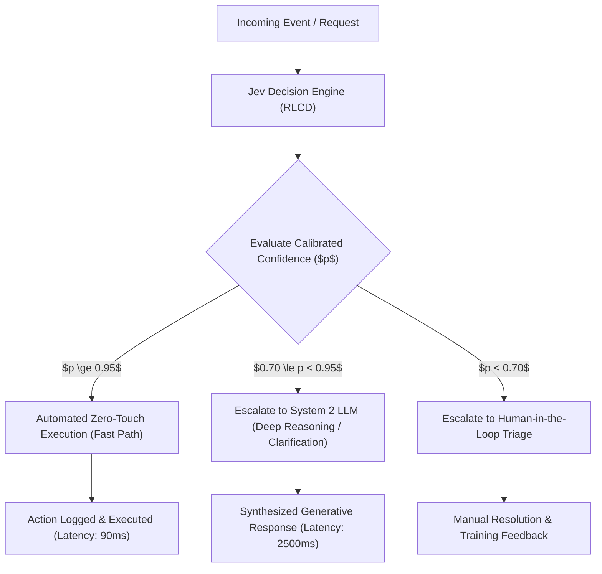

# 🎯 02. RLCD & Calibration Theory

> **Related Notes:**
> - [[README|Master Index]]
> - [[01_Architecture_and_Mechanics|Architecture & Mechanics]]
> - [[03_LLM_Integration_Patterns|LLM Integration Patterns]]
> - [[05_Literature_Review_and_Papers|Literature Review & Papers]]

---

## 1. What is RLCD?

**Reinforcement Learning for Calibrated Decisions (RLCD)** is the core training methodology developed by **TypeSafe AI** for training the Jev model.

While **Diogo Almeida** pioneered **RLHF (Reinforcement Learning from Human Feedback)** during his tenure at OpenAI (powering InstructGPT, ChatGPT, and GPT-4), RLCD represents a critical philosophical and algorithmic departure tailored specifically for programmatic software integration rather than conversational chatter.

---

## 2. Why RLHF Fails for Programmatic Software

In standard RLHF, a reward model is trained on pairwise human comparisons:
$$\mathcal{L}_{\text{RLHF}}(\theta) = -\mathbb{E}_{(x, y_w, y_l) \sim \mathcal{D}} \left[ \log \sigma \left( r_\phi(x, y_w) - r_\phi(x, y_l) \right) \right]$$

### The Pathology of Human Feedback in Decision Making
1. **Sycophancy & False Confidence:** Human evaluators inherently favor answers that sound authoritative, polished, and confident—even when factually incorrect. RLHF systematically trains models to minimize perceived uncertainty, resulting in severe **overconfidence**.
2. **Poor Probability Calibration:** A standard LLM outputting "I am 99% certain this patient has Condition X" is rarely correct 99% of the time. In reality, empirical accuracy may be 70% or lower.
3. **Catastrophic for Software Automation:** If software uses LLM probabilities to automate critical actions (e.g., executing transactions, deleting resources, routing legal notices), uncalibrated overconfidence causes silent, catastrophic automation failures.

```mermaid
graph TD
    subgraph "RLHF (Human Feedback)"
        H1["Prompt / State"] --> H2["Generate Candidate Prose"]
        H2 --> H3["Human Evaluator Preference"]
        H3 -->|Reward: Fluency, Politeness, Persuasiveness| H4["Trained LLM"]
        H4 -->|Side Effect| Overconf["Miscalibrated Overconfidence (Sycophancy)"]
    end

    subgraph "RLCD (Calibrated Decisions)"
        C1["Input State + Typed Questions"] --> C2["Predict Continuous Distribution & Confidence"]
        C2 --> C3["Empirical Ground Truth & Outcome Verification"]
        C3 -->|Reward: Proper Scoring Rules (Brier Score, ECE Penalty)| C4["Trained Jev Engine"]
        C4 -->|Result| Calibrated["Probabilistic Honesty: P(Confidence) = Empirical Accuracy"]
    end

```

---

## 3. The Mathematics of Calibration

A model is defined as **perfectly calibrated** if its predicted probability $\hat{P}$ matches the actual empirical frequency of correctness:
$$\mathbb{P}\left(Y = y \mid \hat{P} = p\right) = p, \quad \forall p \in [0, 1]$$

### 3.1 Expected Calibration Error (ECE)
To quantify calibration across a dataset of $N$ predictions, samples are grouped into $M$ equally spaced confidence bins $B_m \subset (0, 1]$:

$$\text{acc}(B_m) = \frac{1}{|B_m|} \sum_{i \in B_m} \mathbf{1}(\hat{y}_i = y_i)$$
$$\text{conf}(B_m) = \frac{1}{|B_m|} \sum_{i \in B_m} \hat{p}_i$$

The **Expected Calibration Error (ECE)** is the weighted average of the absolute difference between accuracy and confidence across all bins:
$$\text{ECE} = \sum_{m=1}^M \frac{|B_m|}{N} \left| \text{acc}(B_m) - \text{conf}(B_m) \right|$$

In modern uncalibrated LLMs, ECE frequently exceeds **0.15 to 0.35**. Jev's RLCD drives ECE down toward **$< 0.02$**, achieving true statistical alignment.

### 3.2 Proper Scoring Rules: Brier Score and Logarithmic Loss
RLCD leverages **Strictly Proper Scoring Rules** as objective functions. A scoring rule $S(p, y)$ is strictly proper if and only if the expected score is uniquely minimized when the reported probability distribution $p$ equals the true underlying distribution $q$:

#### The Brier Score
For binary and multi-class decisions:
$$\text{BS} = \frac{1}{N} \sum_{i=1}^N \sum_{k=1}^K \left( \hat{p}_{ik} - y_{ik} \right)^2$$
where $y_{ik} \in \{0, 1\}$ is the ground truth one-hot indicator.

The Brier score can be decomposed into:
$$\text{BS} = \text{Uncertainty} - \text{Resolution} + \text{Reliability (Calibration)}$$
RLCD explicitly optimizes the policy gradient to minimize the **Reliability (Calibration)** error component.

---

## 4. Comparing the Three Reinforcement Learning Paradigms

| Dimension | RLHF (Human Feedback) | RLVR (Verifiable Rewards) | RLCD (Calibrated Decisions) |
| :--- | :--- | :--- | :--- |
| **Primary Goal** | Alignment with human aesthetic and conversational taste | Solving verifiable logic, math, and code problems | Delivering statistically honest probabilities for software decisions |
| **Objective / Loss** | Bradley-Terry preference model reward | Binary or stepped verifier reward ($+1$ for pass, $0$ for fail) | Proper scoring rules (Brier / NLL) + ECE minimization penalty |
| **Output Type** | Unstructured generative text (autoregressive) | Step-by-step reasoning tokens (e.g., chain-of-thought) | Structured typed primitives (`Noul`, `Choice`, `Score`) |
| **Confidence Reliability** | Very Low (Severe overconfidence bias) | Moderate (High accuracy on code/math, but poorly calibrated probabilities) | **Extremely High (Calibrated empirical alignment)** |
| **Primary Deployment** | Conversational chatbots, creative writing | Autonomous coding, mathematical theorem proving | **Enterprise software logic, routing, guardrails, automated triage** |

---

## 5. Software Engineering Impact: Deterministic Thresholding

Because Jev provides calibrated probabilities via RLCD, software engineers can design **probabilistically bounded control flows**:



### Practical Thresholding Code
```python
from typesafe_sdk import TypeSafeClient, Noul

client = TypeSafeClient()

def process_automated_refund(transaction_id: str, claim_text: str):
    response = client.system_one(
        state={"claim": claim_text, "transaction_id": transaction_id},
        questions={
            "is_valid_fraud_claim": Noul(
                instructions="Is the user reporting an unauthorized transaction that meets refund policy criteria?"
            )
        }
    )

    noul = response.answers["is_valid_fraud_claim"]
    p = noul.probability

    # Calibrated decisions allow precise mathematical thresholds:
    if p >= 0.95:
        # 95%+ confidence: empirical risk of false positive is <= 5%
        execute_immediate_refund(transaction_id)
        return "AUTOMATED_REFUND"
    elif p >= 0.70:
        # Route to LLM agent for customer dialogue
        return trigger_system_two_reasoning_agent(claim_text)
    else:
        # Low certainty: escalate to fraud analyst
        return escalate_to_human_queue(transaction_id, confidence=p)
```
