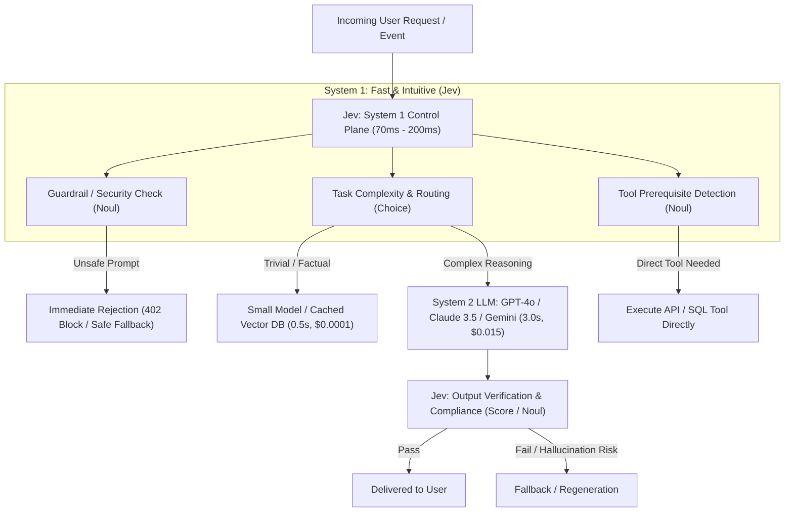

# 🔗 03. Jev Integration Patterns on Top of LLMs

> **Related Notes:**
> - [[README|Master Index]]
> - [[01_Architecture_and_Mechanics|Architecture & Mechanics]]
> - [[02_RLCD_and_Calibration|RLCD & Calibration]]
> - [[04_Use_Cases_and_Benchmarks|Use Cases & Benchmarks]]
> - [[05_Literature_Review_and_Papers|Literature Review & Papers]]

---

## 1. The Dual-Process Cognitive Architecture

The most transformative application of Jev is **not replacing LLMs**, but acting as an ultra-fast **System 1 sensory and control layer** on top of **System 2 generative reasoning LLMs**.



---

## 2. Five Architectural Integration Patterns

### Pattern 1: Dynamic Model Routing & Cascading (RouteLLM Pattern)
*   **The Problem:** 70–80% of enterprise queries sent to frontier models (e.g., GPT-4o, Claude 3.5 Sonnet) are simple factual lookups, basic summarizations, or formatting tasks that do not require frontier intelligence.
*   **Jev Solution:** Jev evaluates query complexity, domain, and reasoning depth in 70ms using a `Choice` primitive.
*   **Impact:** Reduces inference costs by 70–85% while matching 98% of frontier benchmark quality.

```python
from typesafe_sdk import TypeSafeClient, Choice

client = TypeSafeClient()

def route_query(user_query: str):
    decision = client.system_one(
        state={"query": user_query},
        questions={
            "model_tier": Choice(
                instructions="Determine the minimum capability tier required to answer this query accurately.",
                criteria={
                    "cached_lookup": "Exact factual queries, FAQ matching, greetings",
                    "fast_small": "Basic extraction, formatting, simple translation, short summaries",
                    "frontier_reasoning": "Multi-step logic, code synthesis, ambiguous analysis, legal/medical reasoning"
                }
            )
        }
    )

    tier = decision.answers["model_tier"].choice
    if tier == "cached_lookup":
        return fetch_from_semantic_cache(user_query)
    elif tier == "fast_small":
        return call_small_model(user_query, model="gemini-1.5-flash")
    else:
        return call_frontier_model(user_query, model="gpt-4o")
```

---

### Pattern 2: Ultra-Fast Agent Tool Dispatching & Orchestration
*   **The Problem:** In autonomous agent frameworks (e.g., LangGraph, AutoGen, CrewAI), the agent spends 1.5–3 seconds *per loop iteration* having an LLM generate JSON tool calls (`{"tool": "search_db", "args": ...}`).
*   **Jev Solution:** Jev evaluates the environment state and history in a single forward pass, deciding:
    1. Should a tool be called at all? (`Noul`)
    2. Which tool should be called? (`Choice`)
    3. Is the agent stuck in a loop? (`Noul`)
*   **Impact:** Decreases multi-turn agent latency from 15 seconds to under 3 seconds.

```python
from typesafe_sdk import TypeSafeClient, Noul, Choice

client = TypeSafeClient()

def agent_next_step(conversation_history: list, available_tools: list):
    response = client.system_one(
        state={"history": conversation_history},
        questions={
            "should_call_tool": Noul(
                instructions="Does the current turn require executing an external tool or API?"
            ),
            "selected_tool": Choice(
                instructions="Select the most appropriate tool to resolve the immediate next step.",
                criteria={tool["name"]: tool["description"] for tool in available_tools}
            ),
            "is_goal_satisfied": Noul(
                instructions="Has the user's primary objective been fully achieved in the history?"
            )
        }
    )

    if response.answers["is_goal_satisfied"].probability > 0.90:
        return {"action": "TERMINATE_SUCCESS"}

    if response.answers["should_call_tool"].probability > 0.80:
        tool_name = response.answers["selected_tool"].choice
        return {"action": "EXECUTE_TOOL", "tool": tool_name}
    
    return {"action": "GENERATE_FINAL_REPLY"}
```

---

### Pattern 3: Deterministic Real-Time Guardrails & Moderation
*   **The Problem:** Traditional guardrail models (like Llama Guard) are themselves generative or heavyweight, adding 500ms–1500ms latency to every token stream.
*   **Jev Solution:** Jev evaluates prompt injection, jailbreaks, PII leakage, and brand policy violations in parallel (under 100ms).
*   **Pre-execution Guardrail:** Filter the prompt before the expensive LLM is invoked.
*   **Post-execution Guardrail:** Verify the LLM’s output before sending to the client.

```python
from typesafe_sdk import TypeSafeClient, Noul, Score

client = TypeSafeClient()

def pre_execution_guardrail(prompt: str) -> bool:
    res = client.system_one(
        state={"prompt": prompt},
        questions={
            "is_jailbreak_attempt": Noul(
                instructions="Does this prompt attempt to bypass safety boundaries, simulate persona overrides, or perform system instruction extraction?"
            ),
            "contains_pii": Noul(
                instructions="Does the text contain sensitive personal information (SSN, credit card, passwords)?"
            ),
            "safety_risk": Score(
                instructions="Score the security risk of this prompt on a 1 (completely safe) to 5 (critical attack) scale."
            )
        }
    )

    is_jailbreak = res.answers["is_jailbreak_attempt"].probability > 0.70
    is_pii = res.answers["contains_pii"].probability > 0.85
    risk_score = res.answers["safety_risk"].weighted_score

    if is_jailbreak or is_pii or risk_score >= 3.5:
        return False  # Block request immediately
    return True
```

---

### Pattern 4: High-Throughput Evals & "LLM-as-a-Judge" Replacement
*   **The Problem:** Using GPT-4o as a judge for synthetic data generation or CI/CD model evaluation is prohibitively expensive (\$10–\$30 per 1,000 evaluations) and slow.
*   **Jev Solution:** Jev evaluates criteria (faithfulness, conciseness, relevance) using `Score` and `Noul`.
*   **Advantage:** Cost drops from \$15/1k evals to \$0.04/1k evals (a **375x savings**), with calibrated confidence scores enabling automated filtering of ambiguous edge cases.

---

### Pattern 5: Speculative Execution & Search Tree Pruning (Tree-of-Thoughts)
*   **The Problem:** Advanced reasoning paradigms (e.g., Tree-of-Thoughts, Monte Carlo Tree Search for LLMs) explore multiple reasoning paths, requiring hundreds of LLM calls.
*   **Jev Solution:** Jev serves as the heuristic value function $\hat{V}(s)$, scoring candidate intermediate steps in 70ms and pruning unpromising branches before expensive LLM expansion occurs.
