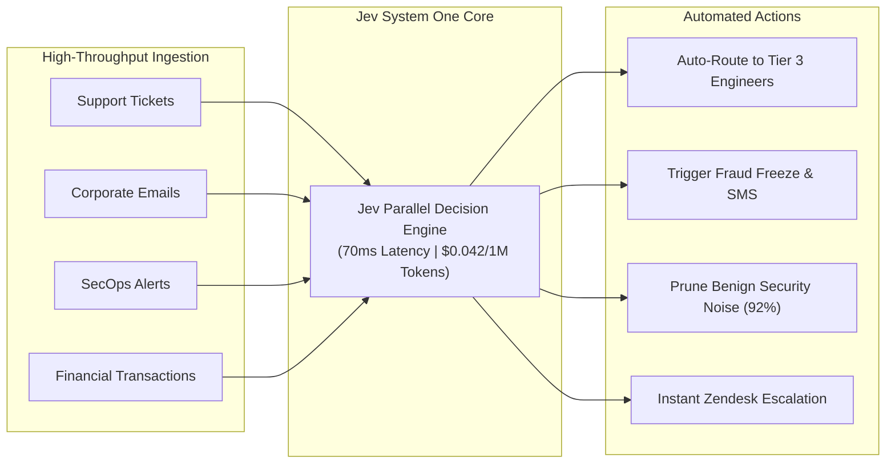

# 📊 04. Jev Use Cases & Industry Benchmarks

> **Related Notes:**
> - [[README|Master Index]]
> - [[01_Architecture_and_Mechanics|Architecture & Mechanics]]
> - [[02_RLCD_and_Calibration|RLCD & Calibration]]
> - [[03_LLM_Integration_Patterns|LLM Integration Patterns]]
> - [[05_Literature_Review_and_Papers|Literature Review & Papers]]

---

## 1. Enterprise Industry Use Cases

Jev's non-autoregressive parallel architecture and RLCD calibration make it ideal for high-volume, low-latency decision pipelines where prose generation is unnecessary or risky.

---

### 1.1 Customer Support & IT Service Management (ITSM)
*   **Context:** Global enterprises handle 100,000+ support tickets and employee IT requests daily.
*   **The Problem:** Using LLMs to parse and classify tickets costs thousands of dollars per day and adds 2–4 seconds of lag. Using legacy regex/BERT models results in poor semantic understanding.
*   **Jev Implementation:**
    - `Choice`: Assigns category (`Billing`, `Hardware`, `Account Access`, `Bug`).
    - `Score`: Assesses customer frustration on a 1–5 scale.
    - `Noul`: Evaluates SLA breach risk (`Is this customer threatening legal or churn action?`).
*   **Result:** 85% of standard tickets automatically routed and tagged in <150ms; critical tickets escalated immediately.

---

### 1.2 Cybersecurity & SOC Alert Triage
*   **Context:** Security Operations Centers (SOCs) are overwhelmed by alert fatigue, receiving 10,000+ alerts daily from EDR and SIEM platforms (Splunk, CrowdStrike).
*   **The Problem:** 95% of alerts are benign false positives, but missing 1 true positive is disastrous.
*   **Jev Implementation:**
    - Jev inspects raw telemetry logs and alert metadata.
    - `Noul`: `is_likely_false_positive` (with calibrated probability).
    - If calibrated probability $> 0.98$, the alert is auto-dismissed.
    - If probability $< 0.98$, escalated to human analyst with full probability breakdown.
*   **Result:** 90% reduction in analyst workload with provable risk bounds.

---

### 1.3 FinTech & Real-Time Transaction Screening
*   **Context:** Payment processors have strict <200ms SLAs to authorize or decline card transactions.
*   **The Problem:** Traditional fraud rules are rigid and easily circumvented; generative LLMs are completely disqualified due to 1.5s+ latency.
*   **Jev Implementation:**
    - Jev processes transaction context (merchant category, geo-velocity, user transaction history) in 80ms.
    - `Score`: Evaluates fraud risk score (1–10).
    - `Noul`: `requires_two_factor_auth_challenge`.
*   **Result:** Real-time semantic risk scoring within existing authorization windows.

---

## 2. Quantitative Benchmark Comparisons

The following benchmarks illustrate the empirical differences between Jev, traditional frontier LLMs, and legacy encoder-only models (e.g., DeBERTa-v3-Large):

| Model | Architecture Type | Avg Latency (P50 / P99) | Cost per 1M Decisions | ECE (Calibration Error) | Zero-Shot Semantic Understanding | Parsing / JSON Reliability |
| :--- | :--- | :--- | :--- | :--- | :--- | :--- |
| **GPT-4o** | Autoregressive Decoder | 1,400ms / 3,800ms | ~\$12.50 | 0.22 (Overconfident) | High | 96.5% (occasional syntax error) |
| **Claude 3.5 Sonnet**| Autoregressive Decoder | 1,600ms / 4,200ms | ~\$15.00 | 0.19 (Overconfident) | High | 97.2% |
| **Gemini 1.5 Flash** | Autoregressive Decoder | 450ms / 1,200ms | ~\$0.85 | 0.26 (Miscalibrated) | Medium-High | 95.0% |
| **DeBERTa-v3-Large** | Bi-directional Encoder | 35ms / 90ms | ~\$0.10 (Self-hosted) | 0.14 | Low (Requires task fine-tuning) | 100% |
| **Jev (TypeSafe)** | **Parallel Sampling Decision** | **85ms / 280ms** | **\$0.042** | **0.018 (Highly Calibrated)** | **High (Zero-shot prompted)** | **100% (Native Typed Primitives)** |

---

## 3. The "Jevons Paradox" of Software Engineering

The model’s namesake, **William Stanley Jevons**, observed that when coal engines became more efficient, coal consumption exploded because coal became viable for thousands of new uses.

Similarly, in software development:
- **At \$0.01 and 3 seconds per call (Frontier LLMs):** AI can only be justified for high-value asynchronous tasks (e.g., generating an entire blog post or summarizing a quarterly report).
- **At \$0.00004 and 85ms per call (Jev):** AI can be embedded directly into:
  - **Inline `if/else` statements** inside web server request handlers.
  - **Database write hooks** to tag and sanitize incoming records.
  - **Loop guards** in automated build and deployment pipelines.
  - **Real-time network packet and log monitors**.
