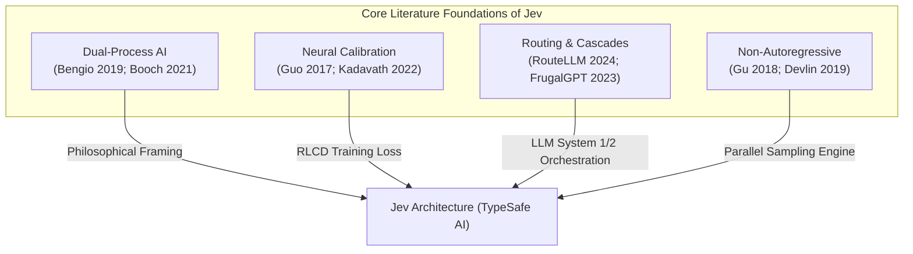

# 📚 05. Academic Literature Review & Related Papers

> **Related Notes:**
> - [[README|Master Index]]
> - [[01_Architecture_and_Mechanics|Architecture & Mechanics]]
> - [[02_RLCD_and_Calibration|RLCD & Calibration]]
> - [[03_LLM_Integration_Patterns|LLM Integration Patterns]]
> - [[04_Use_Cases_and_Benchmarks|Use Cases & Benchmarks]]

---

## 1. Overview of Research Pillars

The architecture of **Jev** is situated at the intersection of four major branches of machine learning research:
1. **Dual-Process Cognitive AI (System 1 vs. System 2)**
2. **Statistical Confidence Calibration & Proper Scoring Rules**
3. **Model Routing, Cascading, and Dynamic Dispatch**
4. **Non-Autoregressive Transformers & Structured Prediction**

---

## 2. Pillar 1: Dual-Process AI (System 1 vs. System 2)

### 📄 Paper 1: *From System 1 Deep Learning to System 2 Deep Learning*
*   **Author:** Yoshua Bengio
*   **Venue:** NeurIPS 2019 (Invited Keynote)
*   **Link / Resource:** [NeurIPS 2019 Presentation](https://slideslive.com/38921750/from-system-1-deep-learning-to-system-2-deep-learning)
*   **Key Concept:** Current deep learning operates primarily as **System 1**: intuitive, fast, parallel, unconscious perception and pattern recognition that requires vast data. System 2, by contrast, is slow, deliberate, conscious, sequential, and capable of causal reasoning and compositional planning.
*   **Relevance to Jev:** TypeSafe explicitly positions Jev as a dedicated **System 1 engine**. While the industry tried to force System 2 models (generative LLMs with chain-of-thought) to perform System 1 tasks (instant classification, routing, and filtering), Jev separates these concerns, creating a native System 1 primitive.

---

### 📄 Paper 2: *Thinking Fast and Slow in AI*
*   **Authors:** Grady Booch, Fabiana Fabiano, Lior Horesh, Kiran Kate, Jonathan Lenchner, Nick Linck, Andrea Loreggia, Keerthiram Murugesan, Nicholas Mattei, Francesca Rossi, Biplav Srivastava
*   **Venue:** AAAI 2021 (arXiv:2010.06002)
*   **Abstract Summary:** The authors propose a multi-agent, dual-system cognitive architecture combining fast, data-driven perceptual networks (System 1) with slow, symbolic constraint solvers and planners (System 2). They formalize the metacognitive controller that decides when System 1 can act autonomously vs. when System 2 must be invoked.
*   **Relevance to Jev:** Provides the theoretical foundation for using Jev's calibrated confidence thresholds ($p \ge \tau$) as the metacognitive boundary between immediate software execution and slow LLM deliberation.

---

## 3. Pillar 2: Confidence Calibration & Statistical Honesty

### 📄 Paper 3: *On Calibration of Modern Neural Networks*
*   **Authors:** Chuan Guo, Geoff Pleiss, Yu Sun, Kilian Q. Weinberger
*   **Venue:** ICML 2017 ([arXiv:1706.04599](https://arxiv.org/abs/1706.04599))
*   **Key Equations & Metrics:**
    *   **Expected Calibration Error (ECE):**
        $$\text{ECE} = \sum_{m=1}^M \frac{|B_m|}{N} |\text{acc}(B_m) - \text{conf}(B_m)|$$
    *   **Temperature Scaling:**
        $$\hat{q}_i = \max_{k} \sigma_{\text{SM}}(z_i / T)^{(k)}$$
*   **Core Finding:** As neural networks became deeper and abandoned weight decay in favor of batch normalization and cross-entropy optimization, their classification accuracy increased while their probability calibration degraded drastically into severe overconfidence.
*   **Relevance to Jev:** Jev’s **RLCD (Reinforcement Learning for Calibrated Decisions)** directly addresses the core finding of Guo et al. Instead of post-hoc temperature scaling (which fails under distribution shift), RLCD optimizes calibration directly in the RL training objective using proper scoring rules.

---

### 📄 Paper 4: *Language Models (Mostly) Know What They Know*
*   **Authors:** Saurav Kadavath, Tom Conerly, Amanda Askell, Tom Henighan, Nelson Elhage, Zac Hatfield-Dodds, Sandra Chen, Scott Johnston, Andy Jones, Sam McCandlish, Dario Amodei, Jared Kaplan et al. (Anthropic)
*   **Venue:** arXiv:2207.05221 (2022)
*   **Key Concept:** Evaluates whether language models possess calibrated self-knowledge. Anthropic shows that models can predict the probability that their generated statements are correct ($P(\text{True})$), and that larger models exhibit better calibration on multiple-choice questions.
*   **Relevance to Jev:** Proves that large transformer representations contain latent, highly calibrated knowledge about truthfulness. Jev extracts this latent representation directly via parallel decision heads rather than relying on generative self-evaluation tokens.

---

## 4. Pillar 3: Model Routing, Cascades, and Dynamic Dispatch

### 📄 Paper 5: *RouteLLM: Learning to Route LLMs with Preference Data*
*   **Authors:** Kevin Ong, et al. (LMSYS / UC Berkeley)
*   **Venue:** ICLR 2025 ([arXiv:2406.18665](https://arxiv.org/abs/2406.18665))
*   **Abstract Summary:** Addresses the high cost of frontier LLMs by training lightweight "router" models that decide whether a given user query can be resolved by a weak model (e.g., Llama-3-8B) or requires a strong model (e.g., GPT-4). They demonstrate that a calibrated router can reduce costs by over 70% while preserving 95%+ of frontier quality.
*   **Relevance to Jev:** Jev is the ideal production implementation of the RouteLLM paradigm. Rather than training and hosting bespoke routing classifiers, developers use Jev's `Choice` primitive to execute dynamic routing decisions in 70ms at \$0.042/1M tokens.

---

### 📄 Paper 6: *FrugalGPT: How to Use Large Language Models While Reducing Cost and Improving Performance*
*   **Authors:** Lingjiao Chen, Matei Zaharia, James Zou (Stanford University)
*   **Venue:** arXiv:2305.05176 (2023)
*   **Key Framework: LLM Cascades:**
    Queries are sent first to an ultra-cheap, fast model. A scoring function assesses the generation quality. If the confidence passes a threshold, the response is accepted; otherwise, the query cascades to progressively larger and more expensive models.
    $$\text{Cost} = \sum_{i=1}^K C_i \cdot \mathbb{P}(\text{Cascade reaches step } i)$$
*   **Relevance to Jev:** Jev provides the precise, calibrated confidence scoring required to make LLM cascades mathematically safe and economically optimal.

---

## 5. Pillar 4: Non-Autoregressive Transformers & Structured Decoding

### 📄 Paper 7: *Non-Autoregressive Neural Machine Translation*
*   **Authors:** Jiatao Gu, James Bradbury, Caiming Xiong, Victor O.K. Li, Richard Socher
*   **Venue:** ICLR 2018 ([arXiv:1711.02281](https://arxiv.org/abs/1711.02281))
*   **Core Innovation:** Replaces sequential $O(T)$ decoding with parallel $O(1)$ generation using fertility predictors and non-autoregressive latent variables, speeding up inference by an order of magnitude.
*   **Relevance to Jev:** Jev takes the non-autoregressive principle to its logical extreme: by eliminating generation altogether and sampling structured decisions in parallel, it eliminates the multimodality problem of non-autoregressive text translation while retaining the $O(1)$ latency advantage.

---

### 📄 Paper 8: *Outlines: Fast and Reliable Text Generation with Guaranteed Regular Expressions*
*   **Authors:** Brandon T. Willard, Rémi Louf
*   **Venue:** arXiv:2307.09702 (2023)
*   **Core Innovation:** Uses deterministic finite automata (DFAs) to mask logits during autoregressive token generation, guaranteeing that outputs match a regular expression or JSON schema.
*   **Relevance to Jev:** Outlines solves schema compliance *within* the autoregressive paradigm, but still suffers from sequential token latency. Jev solves the problem *architecturally* by replacing token generation with native typed primitives.

---

## 6. Literature Synthesis Table

| Paper | Key Contribution | Limitation Addressed by Jev |
| :--- | :--- | :--- |
| **Bengio (2019)** | Defined System 1 (intuitive) vs System 2 (reasoning) | Generative LLMs were improperly used for System 1 tasks |
| **Guo et al. (2017)** | Identified neural miscalibration and ECE metric | Post-hoc temperature scaling degrades under distribution shift; RLCD trains calibration natively |
| **Kadavath et al. (2022)** | Showed LLMs possess latent calibrated self-knowledge | Generative prompting for $P(\text{True})$ is slow and expensive; Jev extracts it via parallel heads |
| **RouteLLM (2024)** | Routing queries between small and frontier models | Requires maintaining custom classifiers; Jev provides zero-shot calibrated routing |
| **FrugalGPT (2023)** | Multi-LLM cascading pipelines | Cascades fail without reliable, calibrated confidence scores |
| **Gu et al. (2018)** | Non-autoregressive parallel decoding | Suffered from output degradation in prose; Jev applies it strictly to typed decisions |
