# 🕸️ 06. Obsidian-Style Knowledge Graph

> **Related Notes:**
> - [[README|Master Index]]
> - [[01_Architecture_and_Mechanics|01. Architecture & Mechanics]]
> - [[02_RLCD_and_Calibration|02. RLCD & Calibration]]
> - [[03_LLM_Integration_Patterns|03. LLM Integration Patterns]]
> - [[04_Use_Cases_and_Benchmarks|04. Use Cases & Benchmarks]]
> - [[05_Literature_Review_and_Papers|05. Literature Review & Papers]]

---

## 1. Complete System Knowledge Graph (Obsidian Graph View)

This graph maps all entities, theoretical foundations, architectural mechanisms, decision primitives, and practical applications across the Jev ecosystem.

```mermaid
graph TD
    %% Core Model
    Jev(["🤖 Jev Model (TypeSafe AI)"]):::core
    
    %% Architectural Attributes
    NonAuto["Parallel Sampling Architecture<br/>(Non-Autoregressive)"]:::arch
    SinglePass["Single Forward Pass<br/>(70ms - 500ms Latency)"]:::arch
    FreeTokens["$0 Output Tokens<br/>($0.042/1M Input)"]:::arch
    ZeroHallucination["Prose-Free / Zero Hallucination"]:::arch
    
    %% Primitives
    Primitives{"Typed Decision Primitives"}:::prim
    Noul["Noul (Binary Probability / [0, 1])"]:::prim
    Choice["Choice (Categorical / up to 255)"]:::prim
    Score["Score (Rubric Expectation / 1-10)"]:::prim

    %% Training Paradigm
    RLCD["RLCD (Reinforcement Learning<br/>for Calibrated Decisions)"]:::train
    Diogo["Diogo Almeida (Co-inventor of RLHF)"]:::people
    ECE["Expected Calibration Error (ECE < 0.02)"]:::math
    Brier["Strictly Proper Scoring Rules<br/>(Brier Score / NLL)"]:::math
    vsRLHF["Replaces RLHF (Eliminates Sycophancy)"]:::train

    %% Integration with LLMs
    DualProcess["Dual-Process AI<br/>(System 1 + System 2)"]:::integ
    LLMRouting["Dynamic LLM Routing & Cascades"]:::integ
    AgentDispatch["Agent Tool Orchestration"]:::integ
    Guardrails["Deterministic Real-Time Guardrails"]:::integ
    Evals["LLM-as-a-Judge Replacement"]:::integ
    TreeSearch["Tree-of-Thoughts Pruning"]:::integ

    %% Papers
    Bengio2019["Bengio (2019)<br/>'From System 1 to System 2'"]:::paper
    Booch2021["Booch et al. (2021)<br/>'Thinking Fast and Slow in AI'"]:::paper
    Guo2017["Guo et al. (2017)<br/>'On Calibration of Modern NNs'"]:::paper
    Kadavath2022["Kadavath et al. (2022)<br/>'LMs Mostly Know What They Know'"]:::paper
    RouteLLM["Ong et al. (2024)<br/>'RouteLLM' (ICLR 2025)"]:::paper
    FrugalGPT["Chen et al. (2023)<br/>'FrugalGPT' (Cascades)"]:::paper
    Gu2018["Gu et al. (2018)<br/>'Non-Autoregressive NMT'"]:::paper

    %% Industry Use Cases
    ITSM["ITSM & Support Ticket Triage"]:::usecase
    FinTech["FinTech Real-Time Fraud (Sub-200ms)"]:::usecase
    SecOps["SecOps Alert De-noising (90% Pruning)"]:::usecase
    Jevons["Jevons Paradox of Software"]:::usecase

    %% Relationships - Core
    Jev --> NonAuto
    Jev --> RLCD
    Jev --> Primitives
    Jev --> DualProcess

    NonAuto --> SinglePass
    NonAuto --> FreeTokens
    NonAuto --> ZeroHallucination

    %% Relationships - Primitives
    Primitives --> Noul
    Primitives --> Choice
    Primitives --> Score

    %% Relationships - Training & Math
    Diogo -->|Founded TypeSafe & Created| Jev
    Diogo -->|Evolved from RLHF to| RLCD
    RLCD --> ECE
    RLCD --> Brier
    RLCD --> vsRLHF

    %% Relationships - Integration
    DualProcess -->|System 1 Control Plane| Jev
    DualProcess -->|System 2 Deep Reasoning| FrontierLLM["Frontier LLMs<br/>(GPT-4o, Claude 3.5, Gemini)"]:::llm
    Jev --> LLMRouting
    Jev --> AgentDispatch
    Jev --> Guardrails
    Jev --> Evals
    Jev --> TreeSearch

    %% Relationships - Papers
    Bengio2019 -.->|Theoretical Framing| DualProcess
    Booch2021 -.->|Metacognitive Boundary| DualProcess
    Guo2017 -.->|Calibration Metrics| ECE
    Kadavath2022 -.->|Latent Truthfulness| Noul
    RouteLLM -.->|Routing Paradigm| LLMRouting
    FrugalGPT -.->|Cascading Logic| LLMRouting
    Gu2018 -.->|Non-Autoregressive Basis| NonAuto

    %% Relationships - Use Cases
    Noul & Choice & Score --> ITSM
    Noul & Score --> FinTech
    Noul --> SecOps
    FreeTokens & SinglePass --> Jevons

    %% Class Styles
    classDef core fill:#4f46e5,stroke:#312e81,stroke-width:3px,color:#ffffff;
    classDef arch fill:#0284c7,stroke:#0369a1,stroke-width:2px,color:#ffffff;
    classDef prim fill:#0d9488,stroke:#115e59,stroke-width:2px,color:#ffffff;
    classDef train fill:#7c3aed,stroke:#5b21b6,stroke-width:2px,color:#ffffff;
    classDef math fill:#c026d3,stroke:#86198f,stroke-width:2px,color:#ffffff;
    classDef integ fill:#ea580c,stroke:#9a3412,stroke-width:2px,color:#ffffff;
    classDef paper fill:#ca8a04,stroke:#854d0e,stroke-width:2px,color:#ffffff;
    classDef usecase fill:#16a34a,stroke:#166534,stroke-width:2px,color:#ffffff;
    classDef people fill:#475569,stroke:#1e293b,stroke-width:2px,color:#ffffff;
    classDef llm fill:#db2777,stroke:#9d174d,stroke-width:2px,color:#ffffff;
```

---

## 2. Interactive Obsidian Canvas / Matrix View

For Obsidian users, here is the functional layout of the note vault as a 2D matrix:

| Layer / Dimension | Concept Notes & Primitives | Research Foundation Papers | Practical Implementation |
| :--- | :--- | :--- | :--- |
| **Inference Layer** | `[[01_Architecture_and_Mechanics]]` - Non-autoregressive sampling - `Noul`, `Choice`, `Score` | - Gu et al. (ICLR 2018) - Willard & Louf (2023) | `typesafe-sdk` single-pass Python execution |
| **Training Layer** | `[[02_RLCD_and_Calibration]]` - RLCD objective - Expected Calibration Error (ECE) | - Guo et al. (ICML 2017) - Kadavath et al. (2022) - Gneiting & Raftery (2007) | Proper scoring rule loss minimization |
| **Orchestration Layer** | `[[03_LLM_Integration_Patterns]]` - Dual-process System 1 / System 2 - Guardrails & Agent dispatch | - Bengio (NeurIPS 2019) - Booch et al. (AAAI 2021) - RouteLLM (ICLR 2025) - FrugalGPT (2023) | Dynamic model router and agent supervisor |
| **Application Layer** | `[[04_Use_Cases_and_Benchmarks]]` - ITSM, FinTech, SecOps - Jevons Paradox | Empirical latency & cost benchmark tables | Automated thresholding & zero-touch execution |

---

## 3. How to Use this Vault in Obsidian

1. **Open Vault:** Open your local Obsidian client and choose **"Open folder as vault"**, selecting `d:\labs\JEV\jev_research`.
2. **Graph View:** Press `Ctrl + G` (or `Cmd + G`) to open the interactive Obsidian Graph View. All bi-directional links (`[[...]]`) will connect the notes dynamically.
3. **Canvas View:** Create a new Canvas and drag all 6 `.md` notes onto the board to explore the visual architecture map.
