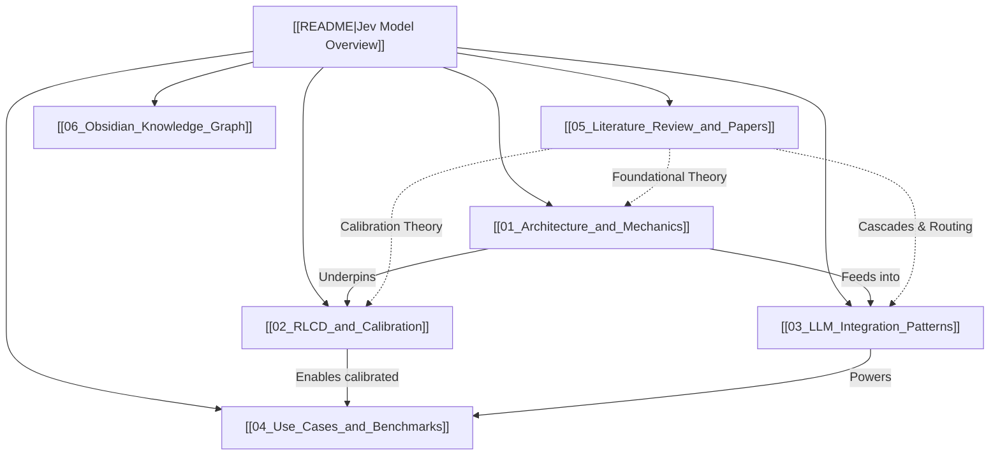

# 🧠 Jev Model Research Knowledge Base

Welcome to the structured knowledge base on **Jev**, the pioneering "System One" decision model developed by **TypeSafe AI** (founded by former OpenAI researcher and RLHF co-inventor **Diogo Almeida**, launched in September 2026).

This vault is organized in an **Obsidian-compatible format**, utilizing bi-directional wikilinks (`[[...]]`), frontmatter metadata, structured tags, and Mermaid knowledge graphs.

---

## 🗺️ Master Navigation

---

## 📑 Knowledge Vault Structure

1. **[[01_Architecture_and_Mechanics]]**
   - Non-autoregressive parallel sampling architecture.
   - Elimination of token-by-token generation overhead.
   - Core decision primitives: `Choice`, `Score`, and `Noul`.
   - Latency dynamics (70ms – 500ms) and zero output token economics ($0.042/1M input tokens).
   - Hallucination-free schema guarantees.

2. **[[02_RLCD_and_Calibration]]**
   - **RLCD** (Reinforcement Learning for Calibrated Decisions) vs. **RLHF** vs. **RLVR**.
   - The mathematics of calibration: Expected Calibration Error (ECE) and Proper Scoring Rules (Brier Score, Logarithmic Loss).
   - Probabilistic honesty: aligning stated confidence with empirical ground truth.
   - Automated thresholding for software and human-in-the-loop escalation.

3. **[[03_LLM_Integration_Patterns]]**
   - Dual-process AI: System 1 (Jev) + System 2 (Generative/Reasoning LLMs).
   - Pattern 1: **Dynamic Model Routing & Cascades** (e.g., RouteLLM / FrugalGPT patterns).
   - Pattern 2: **High-Speed Agent Orchestration & Tool Selection**.
   - Pattern 3: **Deterministic Real-Time Guardrails & Moderation**.
   - Pattern 4: **Automated Evals & LLM-as-a-Judge Replacement**.
   - Pattern 5: **Speculative Execution & Early Exit Pruning**.
   - Python code examples using the official `typesafe-sdk`.

4. **[[04_Use_Cases_and_Benchmarks]]**
   - Enterprise ticket and email triage.
   - Financial fraud detection and real-time trade signals.
   - Cybersecurity alert filtering and automated incident triage.
   - Benchmark comparisons: Jev vs. GPT-4o / Claude 3.5 Sonnet / Gemini 1.5 Pro on latency, cost, and classification accuracy.

5. **[[05_Literature_Review_and_Papers]]**
   - **Dual-Process AI**: Bengio (2019) *From System 1 Deep Learning to System 2 Deep Learning*, Booch et al. (2021) *Thinking Fast and Slow in AI*.
   - **Neural Calibration**: Guo et al. (ICML 2017) *On Calibration of Modern Neural Networks*, Kadavath et al. (Anthropic 2022) *Language Models (Mostly) Know What They Know*.
   - **Routing & Cascades**: Ong et al. (ICLR 2025) *RouteLLM*, Chen et al. (2023) *FrugalGPT*.
   - **Non-Autoregressive & Constrained Generation**: Gu et al. (ICLR 2018), Willard & Louf (2023) *Outlines*.

6. **[[06_Obsidian_Knowledge_Graph]]**
   - Full Mermaid-based bi-directional knowledge map connecting all concepts, methods, primitives, and papers.
